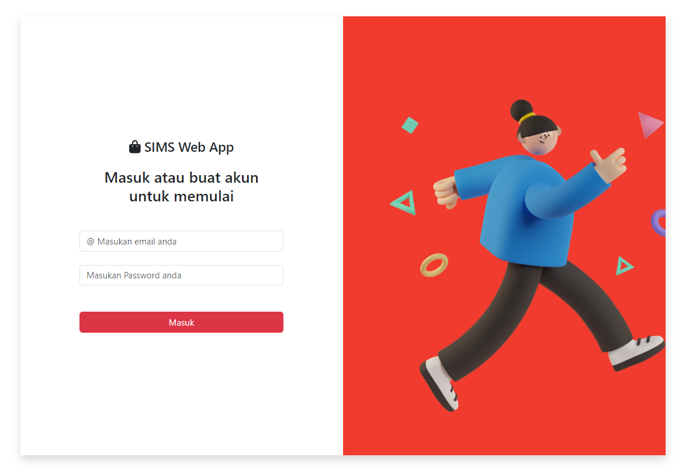
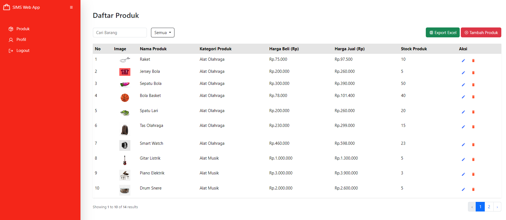
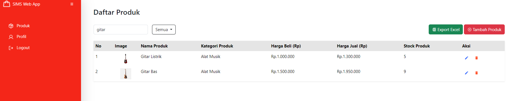
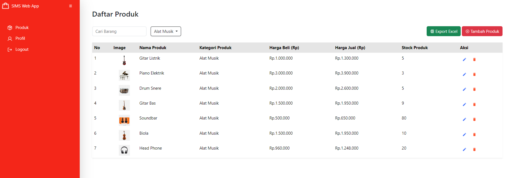
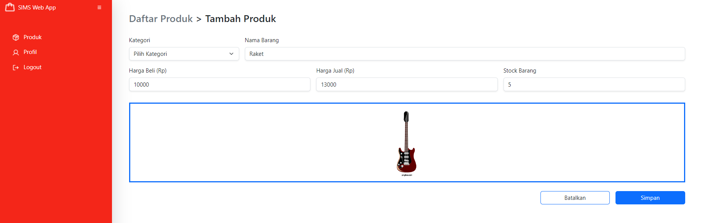
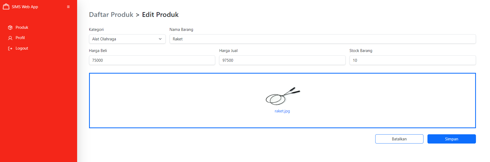
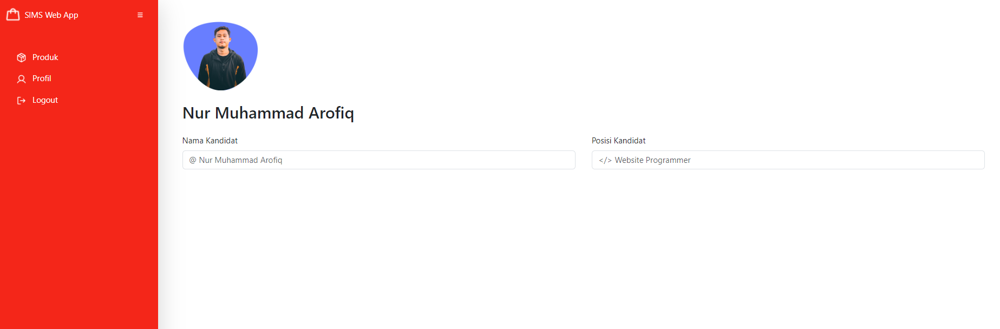

# Penginstalan

- run `` https://github.com/Fiqsss/simpsapp.git ``
- run ``composer install ``
- copy .env.example to .env
- run `` php artisan key:generate ``
- set up your database in the .env
- run `` php artisan migrate --seed ``
- run `` php artisan storage:link ``
- run `` php artisan serve ``
- then visit `` http://localhost:8000 or http://127.0.0.1:8000 ``.

# Admin Credentials
> Email: admin@admin.com || Password: @admin123

## Demo

